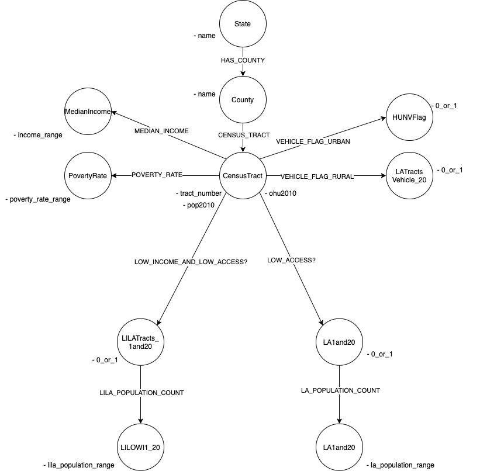
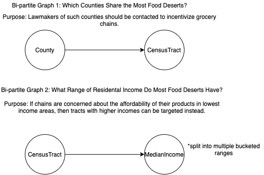

# DSBA-6520-Project
## Proposal
&nbsp;&nbsp;&nbsp;&nbsp;&nbsp;&nbsp;For this project, I have chosen to work with a dataset detailing food deserts in America from Kaggle, which has been pulled and organized from USDA’s Economic Research Service website. The dataset consists of 78k rows and can be accessed here - https://www.kaggle.com/tcrammond/food-access-and-food-deserts. A food desert is defined by the USDA as "living more than one mile from a supermarket in urban/suburban areas, and more than 10 miles from a supermarket in rural areas.” Areas likely to become food deserts exist on opposite spectrums of population density, are low income, have high levels of unemployment, and inadequate access to transportation. Residents of these areas struggle with access to fresh and nutritious foods, leading to a reliance on fast-food establishments and corner stores in order to sustain themselves. Combine these low quality of life factors with a poor diet, and residents are at substantial risk for a number of physical and even mental health problems. Unfortunately, grocery store chains are reluctant to establish a presence in such areas despite the potential to take the entire market share. It is often up to local policymakers to incentivize supermarkets to move to the area by offering tax credits.  
	&nbsp;&nbsp;&nbsp;&nbsp;&nbsp;&nbsp;I intend to utilize the dataset provided to pinpoint locations that are in most dire need for supermarkets, and see if there are any commonalities between income ranges and poverty rates in relation to the chances of a tract’s classification as a food desert. There is a high level of dimensionality in the dataset (147), but many columns are redundant and will be dropped for the purpose of my investigation. For example, there are 3 Boolean columns for low access tracts at 1, 10, and 20 miles respectively, so to reduce dimensionality and align with my vision, I will only consider the 20 mile column. There are also columns further breaking down the populations by ethnicity and age, but since I want the highest-level view of the data, these variables will be dropped as well. This is a very detailed dataset with a large mix of Boolean and continuous variables, so further guidance for dimensionality reduction and refinement will likely be needed. Below is my rough draft of the overarching graph design for this set, and two bipartite views:  
  
 
